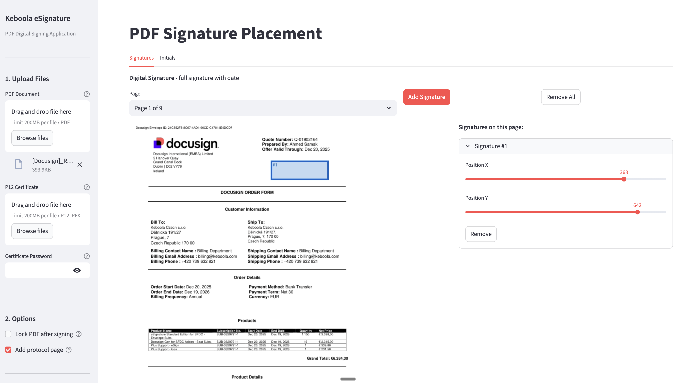

# Keboola eSignature

A Streamlit web application for digitally signing PDF documents using P12/PFX certificates.

## Features

- **Digital Signatures** - Add cryptographically valid signatures to PDF documents
- **Initials (Paraph)** - Add initials to multiple pages as "seen by" confirmation
- **Custom Appearance** - Signatures display name in elegant script font with date/time in standard font
- **Protocol Page** - Optional summary page with certificate and signature details
- **PDF Locking** - Optionally lock the PDF to prevent modifications after signing
- **Drag & Drop Positioning** - Visual placement of signatures on PDF pages

## Screenshot



The application provides a clean interface with:
- Sidebar for file uploads, options, and signing
- Main area with tabs for Signatures and Initials placement
- Live PDF preview with signature position indicators

## Installation

### Prerequisites

- Python 3.9+
- pip

### Setup

1. Clone the repository:
   ```bash
   git clone https://github.com/keboola/esignature.git
   cd esignature
   ```

2. Create and activate a virtual environment:
   ```bash
   python -m venv .venv
   source .venv/bin/activate  # On Windows: .venv\Scripts\activate
   ```

3. Install dependencies:
   ```bash
   pip install -r requirements.txt
   ```

4. Run the application:
   ```bash
   streamlit run app.py
   ```

5. Open your browser at `http://localhost:8501`

## Usage

1. **Upload Files**
   - Upload the PDF document you want to sign
   - Upload your P12/PFX certificate file
   - Enter the certificate password

2. **Add Signatures**
   - Switch to the "Signatures" tab
   - Select the page and click "+ Add Signature"
   - Adjust position using the sliders
   - Repeat for multiple signatures if needed

3. **Add Initials (Optional)**
   - Switch to the "Initials" tab
   - Select corner position (bottom left/right)
   - Choose which pages should have initials
   - Adjust offset if needed

4. **Sign & Download**
   - Configure options (lock PDF, add protocol page)
   - Click "Sign PDF"
   - Download the signed document

## Signature Appearance

### Full Signature
- **Line 1**: Signer name in Dancing Script font (elegant handwriting style)
- **Line 2**: Date and time in Helvetica (standard font)
- **Line 3**: GitHub repository link (small text)

### Initials
- Just the initials (e.g., "PS") in a bordered box
- No date/time for cleaner appearance
- Czech diacritics automatically normalized (e.g., S -> S)

## Dependencies

| Package | Purpose |
|---------|---------|
| streamlit | Web application framework |
| pyhanko | PDF digital signature library |
| PyMuPDF (fitz) | PDF rendering and manipulation |
| cryptography | Certificate handling |
| pillow | Image processing for previews |

## Project Structure

```
esignature/
├── app.py              # Streamlit application
├── signer.py           # PDF signing logic
├── fonts/
│   ├── DancingScript-Regular.ttf  # Signature font (OFL licensed)
│   └── OFL.txt         # Font license
├── docs/
│   └── screenshot.png  # Application screenshot
├── requirements.txt    # Python dependencies
├── LICENSE             # MIT License
└── README.md
```

## Technical Details

### Signing Process

1. Visual appearance is rendered using PyMuPDF (allows mixed fonts)
2. Cryptographic signature is applied using pyhanko
3. Each signature is added incrementally to preserve previous signatures

### Certificate Support

- PKCS#12 (.p12, .pfx) certificates
- Extracts signer name from certificate's Common Name (CN)
- Displays certificate validity and issuer information

## License

### Application
MIT License

### Dancing Script Font
SIL Open Font License, Version 1.1
- Created by Pablo Impallari
- Free for personal and commercial use
- [Font Source](https://github.com/impallari/DancingScript)

## Contributing

Contributions are welcome! Please feel free to submit a Pull Request.

## Links

- [GitHub Repository](https://github.com/keboola/esignature)
- [Keboola](https://www.keboola.com)
